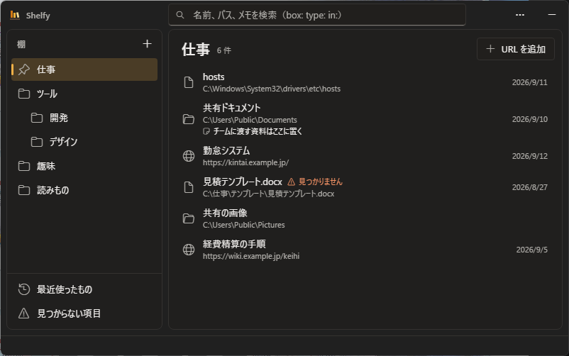

# 

**Shelfy** は「棚（Shelf）」という概念でファイル・フォルダ・URL の参照を整理し、グローバルホットキーで即呼び出して起動できる **軽量ランチャー** です。



## ✨ 特徴

- 🗂️ **シンプルな整理** - タグを使わず「棚に置く」感覚で整理
- ⚡ **高速起動** - グローバルホットキーで即座に呼び出し
- 📁 **参照管理** - 実体ファイルは移動・変更せず、参照のみを管理
- 🔍 **即時検索** - Shelf名、表示名、パス、メモを横断検索
- 🖥️ **常駐型** - システムトレイに常駐し、いつでもアクセス可能

## 📦 対応アイテム

| 種別   | 説明              |
| ------ | ----------------- |
| File   | ファイルへの参照  |
| Folder | フォルダへの参照  |
| URL    | Webページへの参照 |

## 🪶 軽くなりました

Shelfy は、軽量化と高速化のために Rust と Tauri v2 で作り直しました。

| 版     | 構成                   | 単一 exe     | 起動   | ホットキー→表示 |
| ------ | ---------------------- | ------------ | ------ | --------------- |
| v1.0.0 | C# / WPF / SQLite      | 174 MiB      | 未計測 | 未計測          |
| v2.0.0 | Rust / Tauri v2 / JSON | **3.48 MiB** | 310 ms | **1.4 ms**      |

配布物は **50 分の 1** になりました。v1.0.0 の 174 MiB のうち約 165 MiB は .NET ランタイムと WPF 本体で、自作コードは 300 KiB 弱でした。描画を Windows に元からある WebView2 へ任せることで、実行ファイルには自分のコードだけを載せています。

仕様と設計は [doc/](doc/) にあります。

### 必要なもの

**Microsoft Edge WebView2 ランタイム**。Windows 11 には標準で入っています。入っていない環境では、起動時にその旨を案内します。

### v1.0.0 からデータを移す

1. v1.0.0 の「📤 Export」で JSON を書き出す
2. 本版の「取込」で読み込む

v1.0.0 を起動できない場合は、`tools/shelfy-migrate` で `shelfy.db` から直接 JSON を作れます。手順は [DATA_MIGRATION.md](doc/DATA_MIGRATION.md) にあります。

以前の版はタグ `v1.0.0` から取得できます。

```bash
git checkout v1.0.0
```

## 🏗️ アーキテクチャ

Clean Architecture（Ports & Adapters）を採用し、依存方向は常に「外 → 内」です。

```text
┌──────────────────────────────┐
│ UI（WebView2 / TypeScript）  │  ← src/
├──────────────────────────────┤
│ Adapters（永続化、Win32）    │  ← src-tauri/src/adapters/
├──────────────────────────────┤
│ Ports（trait）               │  ← src-tauri/src/ports.rs
├──────────────────────────────┤
│ UseCases                     │  ← src-tauri/src/usecases/
├──────────────────────────────┤
│ Domain                       │  ← src-tauri/src/domain.rs
└──────────────────────────────┘
```

### 構成

| 場所                         | 説明                                          |
| ---------------------------- | --------------------------------------------- |
| `src-tauri/src/domain.rs`    | ドメインモデル                                |
| `src-tauri/src/usecases/`    | ユースケース                                  |
| `src-tauri/src/ports.rs`     | ポート（trait）                               |
| `src-tauri/src/adapters/`    | JSON スナップショットによる永続化、Win32 連携 |
| `src-tauri/src/commands.rs`  | 画面との境界（IPC、参照系）                   |
| `src-tauri/src/mutations.rs` | 画面との境界（IPC、更新系）                   |
| `src/`                       | フロントエンド（Svelte + TypeScript）         |
| `tools/shelfy-migrate/`      | v1.0.0 からの移行ツール（配布物には含めない） |

## 🛠️ 開発環境

- **Rust**（版数は `rust-toolchain.toml` で固定）
- **Tauri v2** と **WebView2**（Windows 11 には標準搭載）
- **Node.js 22**（フロントエンドのビルドにだけ使います）

## 🚀 ビルドとテスト

```bash
git clone https://github.com/ktama/Shelfy.git
cd Shelfy
npm install

# 開発中の起動
npm run tauri dev

# 実行ファイルを作る
npm run tauri build -- --no-bundle

# バックエンドのテスト（169 件）
cd src-tauri && cargo test
```

実データに触れずに動かしたいときは、環境変数 `SHELFY_DATA_DIR` で保存先を差し替えられます。

## 📖 使い方

規則の詳細は [doc/SPECIFICATION.md](doc/SPECIFICATION.md) にあります。

### 基本操作

1. **起動** - アプリはシステムトレイに常駐します
2. **呼び出し** - `Ctrl+Shift+Space` でウィンドウを表示/非表示
3. **Shelf 作成** - 棚の一覧の見出しにある「＋」または `Ctrl+N`（子の棚は、棚の右クリックメニューから）
4. **アイテム追加** - ファイル・フォルダを Shelf 選択中のウィンドウにドラッグ＆ドロップ
5. **アイテム起動** - ダブルクリックまたは `Enter` キー
6. **閉じる** - `Escape` キーでウィンドウを非表示（トレイに常駐）

### 検索

検索ボックスに文字を入力すると即時検索が実行されます。以下のプレフィックスで検索対象を絞り込めます：

| プレフィックス | 説明                                        | 例          |
| -------------- | ------------------------------------------- | ----------- |
| `box:`         | Shelf 名で絞り込み                          | `box:仕事`  |
| `type:`        | アイテムの種別で絞り込み（file/folder/url） | `type:url`  |
| `in:`          | 指定 Shelf 内のアイテムに限定               | `in:ツール` |
| *(なし)*       | 表示名・パス・メモを横断検索                | `report`    |

### 並び替え

- **コンテキストメニュー** - Shelf / Item を右クリック →「上へ」「下へ」
- **ドラッグ＆ドロップ** - Item リスト内でドラッグして並び替え

### データ管理

- **エクスポート** - 右上の「⋯」→「書き出す」で全データを JSON ファイルに保存
- **インポート** - 右上の「⋯」→「取り込む」で JSON ファイルからデータを復元（「足す」か「置き換える」を選ぶ）
- **設定** - 右上の「⋯」→「設定」でホットキー、起動時最小化、ウィンドウサイズなどを変更
- **保存先** - `%LOCALAPPDATA%\Shelfy\shelfy.json`（環境変数 `SHELFY_DATA_DIR` で差し替え可）

### キーボードショートカット

| キー               | 操作               |
| ------------------ | ------------------ |
| `Ctrl+Shift+Space` | グローバル呼び出し |
| `Ctrl+N`           | 新規 Shelf 作成    |
| `Enter`            | アイテム起動       |
| `F2`               | アイテム名変更     |
| `Delete`           | アイテム削除       |
| `Ctrl+R`           | 再読み込み         |
| `Escape`           | ウィンドウ非表示   |

## 📖 ドキュメント

[doc/](doc/) に一式を置いてあります。

| ドキュメント                               | 説明                                              |
| ------------------------------------------ | ------------------------------------------------- |
| [SPECIFICATION.md](doc/SPECIFICATION.md)   | 振る舞いの規則。ドメイン、検索、画面、非機能要件  |
| [ARCHITECTURE.md](doc/ARCHITECTURE.md)     | 実現の仕方。層、IPC、永続化、Windows 連携、ビルド |
| [DESIGN.md](doc/DESIGN.md)                 | 見た目の決まり。色、文字、寸法、状態、アイコン    |
| [DATA_MIGRATION.md](doc/DATA_MIGRATION.md) | 保存形式、交換形式、v1.0.0 からの移行             |
| [DEVELOPMENT.md](doc/DEVELOPMENT.md)       | 環境、テスト、手動確認、計測、CI                  |

## 📝 ライセンス

[MIT License](LICENSE)

Copyright (c) 2025 ktama
